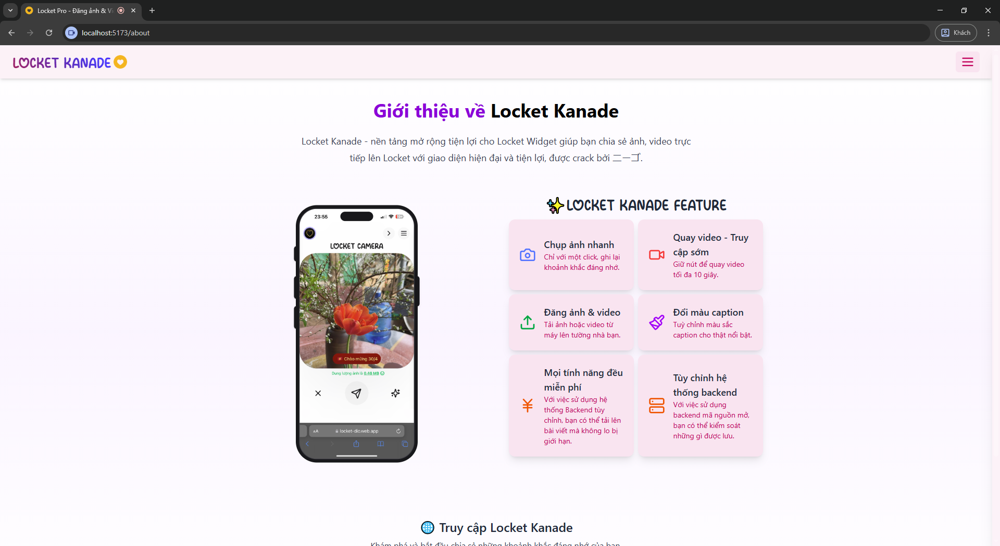

# 📸 Locket Dio — Frontend

<div align="center">
  
  <p>
    Ứng dụng web chia sẻ ảnh & video lấy cảm hứng từ Locket — PWA, realtime, và tối ưu cho mobile.
  </p>
</div>

---

## ❯ Tổng quan nhanh

- Ngôn ngữ: JavaScript (React + Vite)
- Styling: Tailwind CSS
- Tính năng nổi bật: chụp/quay trực tiếp, upload media, hỗ trợ offline (IndexedDB), push notification và PWA.

Demo trực tiếp: https://locket-dio.com

---

## ✨ Nổi bật (Tóm tắt tính năng)

- Xác thực an toàn (JWT)
- Chụp ảnh & quay video ngay trong trình duyệt
- Upload file & chỉnh sửa media (crop, caption)
- Hệ thống tương tác (thả tim, comments)
- Offline-ready với IndexedDB (dexie)
- PWA + Push Notification (Firebase)
- Tối ưu mobile, animations mượt mà (Framer Motion)

---

## 🚀 Demo

Truy cập demo online: https://locket-dio.com

Ảnh chụp giao diện (mở trong repo):

<details>
<summary>🖼️ Xem ảnh giao diện</summary>

<div align="center">
  
  
  
</div>

</details>

---

## 🛠️ Cài đặt & chạy nhanh

Yêu cầu: Node.js >= 18, npm hoặc yarn

Clone repository và cài đặt:

```bash
git clone https://github.com/doi2523/Client-Locket-Dio.git
cd Client-Locket-Dio
npm install
```

Chạy development server:

```bash
npm run dev
```

Build production:

```bash
npm run build
npm run preview
```

Mặc định dev server chạy trên: http://localhost:5173

---

## ⚙️ Cấu hình môi trường

Tạo file `.env` ở root với các biến sau (ví dụ):

```env
# API chính
VITE_BASE_API_URL=https://apilocket-diov2.onrender.com

# Storage / Upload
VITE_STORAGE_API_URL=https://storage.locket-dio.com

# VAPID key cho Web Push
VITE_VAPID_PUBLIC_KEY=your_vapid_public_key_here
```

Lưu ý: không commit file `.env` có chứa secret.

---

## 📁 Cấu trúc thư mục (tóm tắt)

src/
- assets/        # hình ảnh, font
- components/    # UI component tái sử dụng
- context/       # React contexts (Auth, Theme...)
- layouts/       # layout chính
- pages/         # trang (Home, Auth, Chat...)
- lib/           # axios, socket helpers
- services/      # API call wrappers

---

## 📚 Công nghệ chính

- React 18, Vite
- Tailwind CSS
- Firebase (messaging)
- Axios, dexie (IndexedDB)
- Framer Motion

---

## 🤝 Đóng góp

Rất hoan nghênh PRs!

1. Fork repo
2. Tạo branch: git checkout -b feature/ten-tinh-nang
3. Cài đặt & chạy, viết test nếu có
4. Tạo PR mô tả thay đổi

Xem `CONTRIBUTING.md` (nếu có) cho quy tắc chi tiết.

---

## 🧪 Kiểm thử (gợi ý)

- Chạy linter / formatter nếu có: `npm run lint` / `npm run format`
- Chạy unit / integration test (nếu repo có test): `npm test`

---

## ⚠️ Ghi chú quan trọng

- Backend có thể private — một số API demo/production không public.
- Kiểm tra các biến môi trường và token trước khi push.

---

Nếu bạn muốn, tôi có thể sửa tone (trang trọng/hài hước), thêm bản tiếng Anh, hoặc chèn badges (CI, license, coverage).

---

### Tiếp theo tôi đã làm

- Drafted and replaced `README.md` with a clearer, more attractive Vietnamese README.