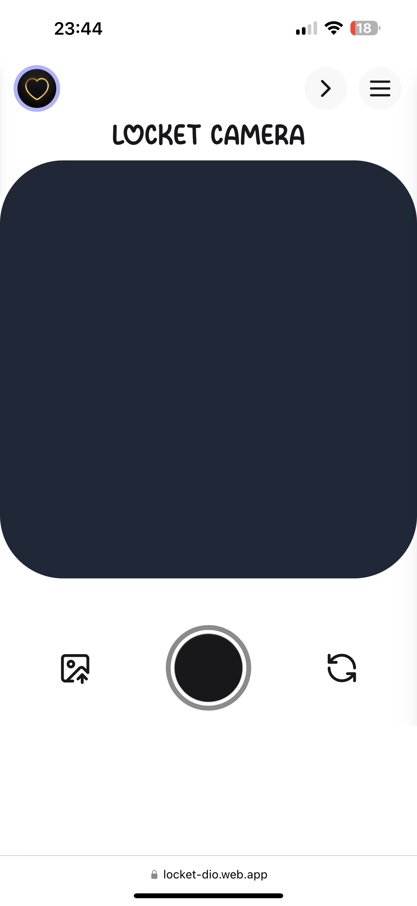
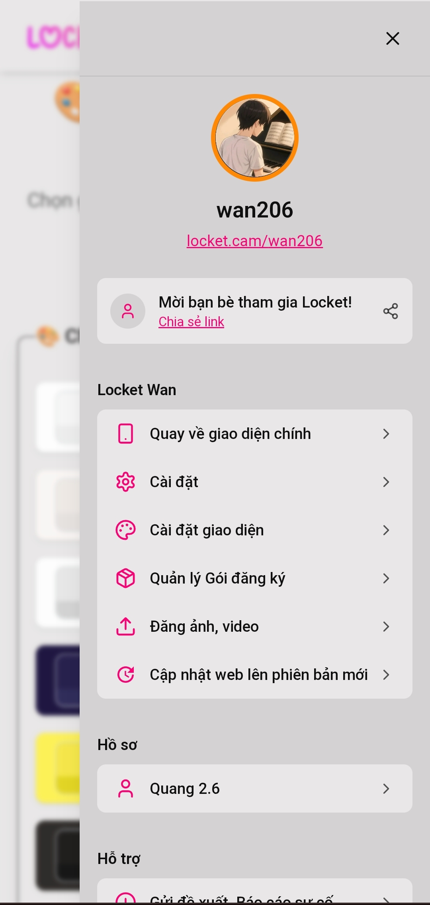
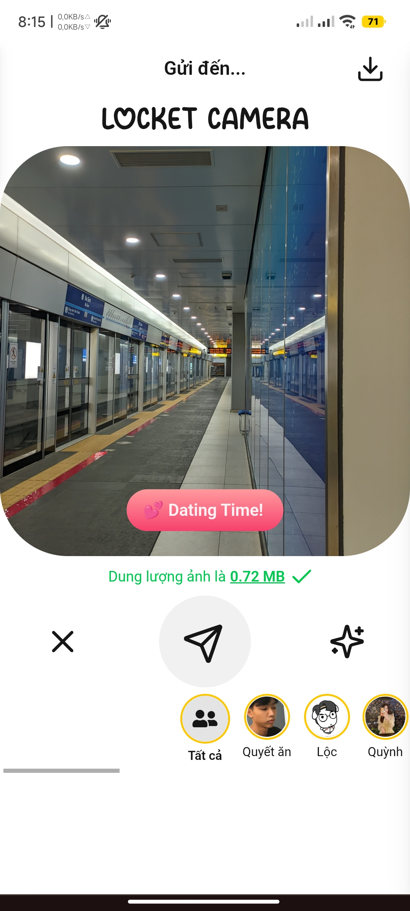

# 📸 Locket Dio — Frontend

<div align="center">
  
  <p>
    Ứng dụng web chia sẻ ảnh & video lấy cảm hứng từ Locket — PWA, realtime, và tối ưu cho mobile.
  </p>
</div>

---

## ❯ Tổng quan nhanh

- Ngôn ngữ: JavaScript (React + Vite)
- Styling: Tailwind CSS
- Tính năng nổi bật: chụp/quay trực tiếp, upload media, hỗ trợ offline (IndexedDB), push notification và PWA.

Demo trực tiếp: https://locket.wangtech.top

---

## ✨ Nổi bật (Tóm tắt tính năng)

- Xác thực an toàn (JWT)
- Chụp ảnh & quay video ngay trong trình duyệt
- Upload file & chỉnh sửa media (crop, caption)
- Hệ thống tương tác (thả tim, comments)
- Offline-ready với IndexedDB (dexie)
- PWA + Push Notification (Firebase)
- Tối ưu mobile, animations mượt mà (Framer Motion)

---

## 🚀 Demo

Truy cập demo online: https://locket.wangtech.top

Ảnh chụp giao diện (mở trong repo):

<details>
<summary>🖼️ Xem ảnh giao diện</summary>

<div align="center">
  
  
  
</div>

</details>

---

## 🛠️ Cài đặt & chạy nhanh

Yêu cầu: Node.js >= 18, npm hoặc yarn

Clone repository và cài đặt:

```bash
git clone https://github.com/bquang2k6/locket.git
cd thư mục vừa tạo
npm install
```

Chạy development server:

```bash
npm run dev
```

Build production:

```bash
npm run build
npm run preview
```

Mặc định dev server chạy trên: http://localhost:5173

---

## ⚙️ Cấu hình môi trường

Tạo file `.env` ở root với các biến sau (ví dụ):

```env example
# API WS
VITE_BASE_API_URL_WS=

# Storage / Upload
VITE_BASE_API_URL=

# DB
VITE_BASE_API_URL_DB=
```

Lưu ý: không commit file `.env` có chứa secret.

---

## 📁 Cấu trúc thư mục (tóm tắt)

src/
- assets/        # hình ảnh, font
- components/    # UI component tái sử dụng
- context/       # React contexts (Auth, Theme...)
- layouts/       # layout chính
- pages/         # trang (Home, Auth, Chat...)
- lib/           # axios, socket helpers
- services/      # API call wrappers

---

## 📚 Công nghệ chính

- React 18, Vite
- Tailwind CSS
- Firebase (messaging)
- Axios, dexie (IndexedDB)
- Framer Motion

---


## ⚠️ Ghi chú quan trọng

- Backend có thể private — một số API demo/production không public.
- Kiểm tra các biến môi trường và token trước khi push.

---

### Chân thành cảm ơn @doi2523

- Dự án được clone lại từ tháng 6 và tui tự phát triển thêm 
- Thư mục app gốc `https://github.com/doi2523`
- Đóng góp BE và FE `https://github.com/ShindouAris`
- @ShindouAris và @doi2523 giúp tôi học được nhiều thứ từ lúc chưa biết đến BE 
